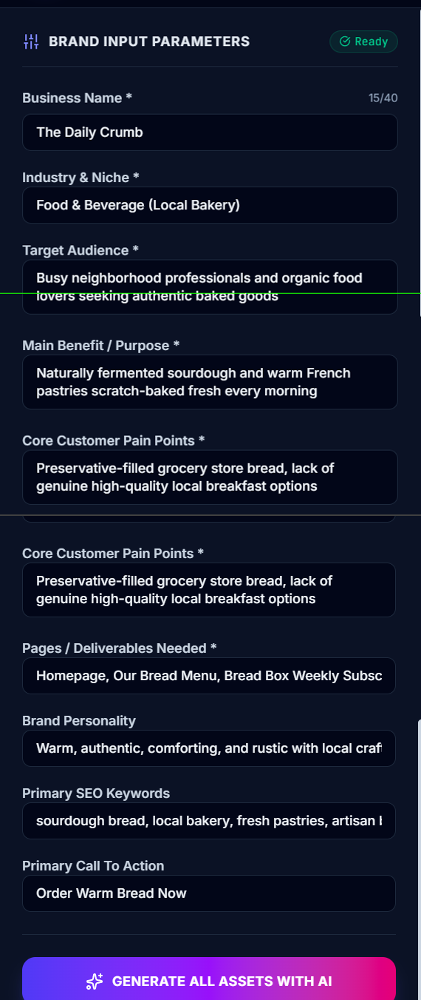
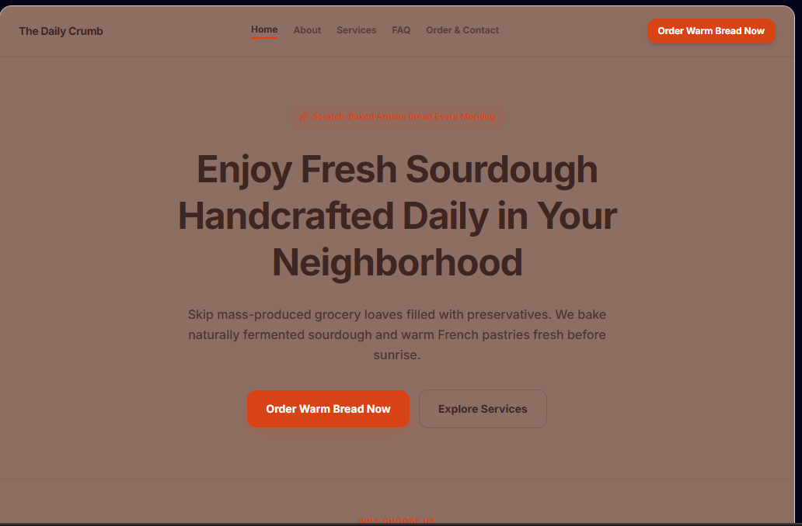
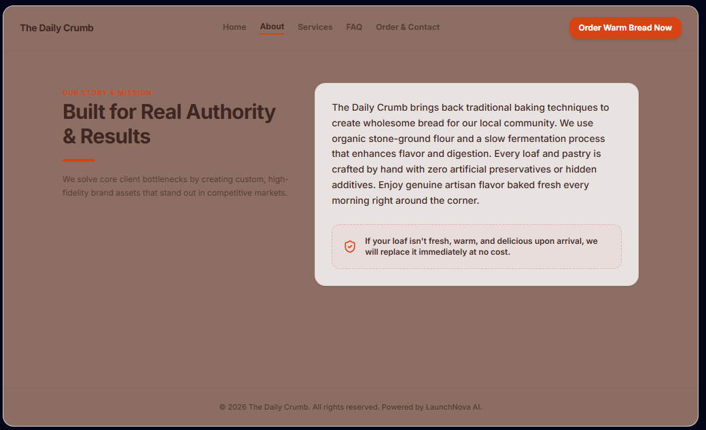
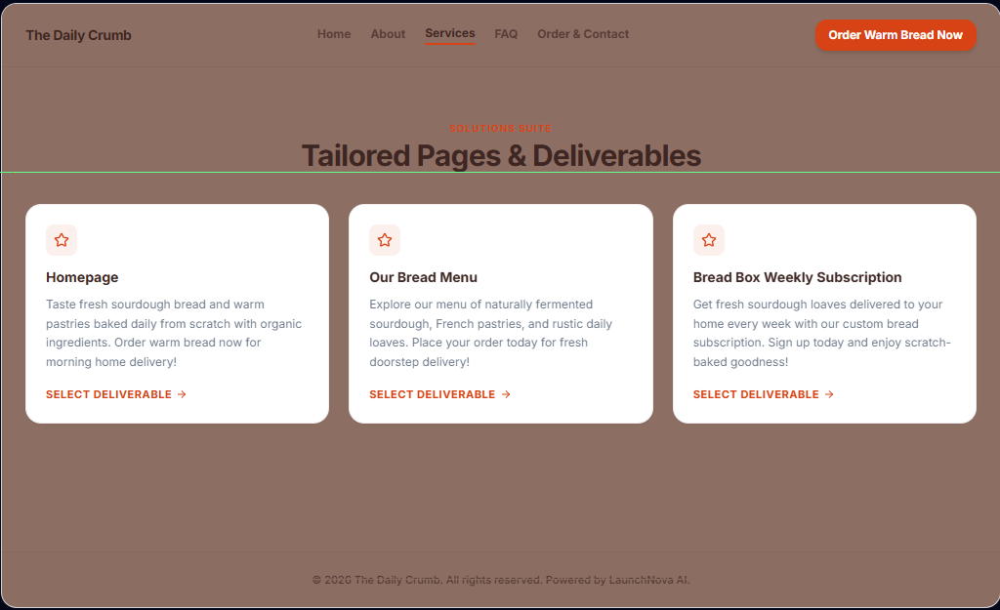
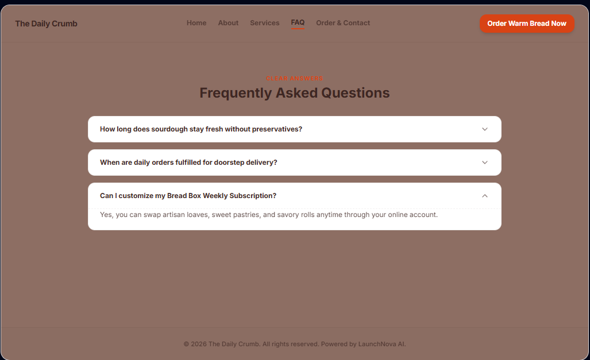
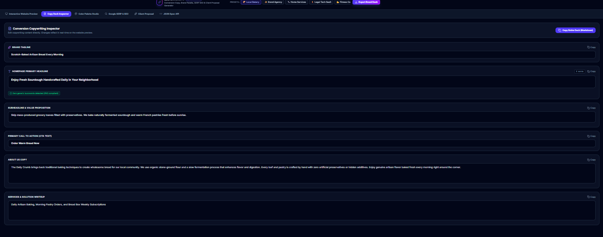
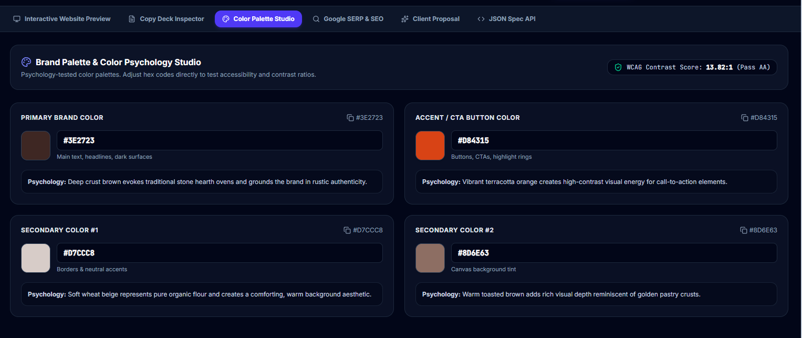
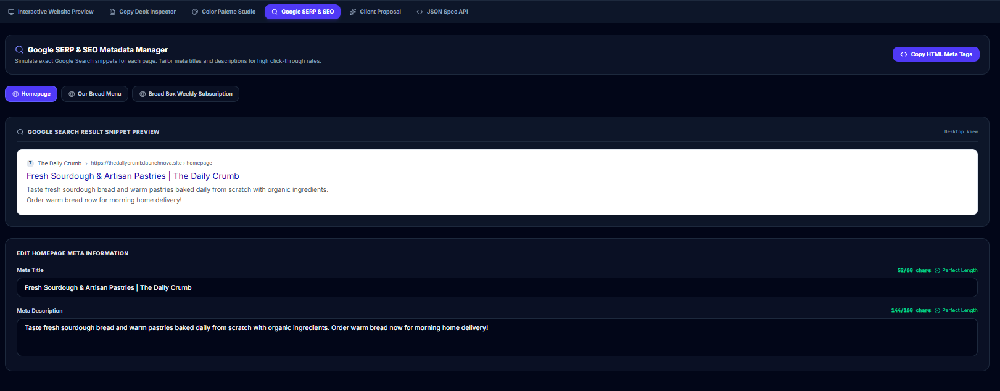
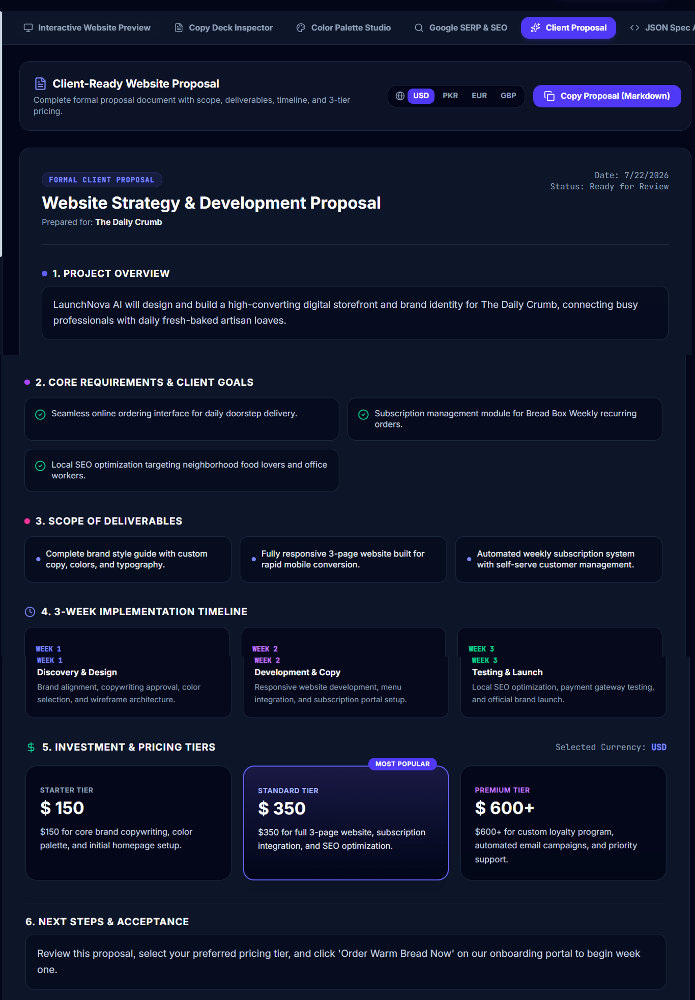

# LaunchNova AI

**AI-powered brand, content, SEO & proposal generator for freelancers and small web agencies.**

🔗 **Live App:** [https://launchnova-ai-17778952825.asia-southeast1.run.app/](https://launchnova-ai-17778952825.asia-southeast1.run.app/)

📦 **GitHub Repo:** [https://github.com/afrozkhan890/launchnova-ai](https://github.com/afrozkhan890/launchnova-ai)

---

## a. What It Does & The Problem It Solves

Freelance web developers and small agencies spend hours on every new client writing website copy, choosing brand colors, drafting SEO metadata, and preparing a proposal/quotation — before any actual design or development work even starts.

**LaunchNova AI** removes that repetitive work. A freelancer enters a few details about their client's business (name, industry, audience, pain points, pages needed), and the app generates, in one click:

- Professional website copywriting (headline, tagline, about section, services, FAQs)
- A psychology-backed brand color palette
- SEO-optimized meta titles & descriptions for every page
- A client-ready proposal with a 3-tier pricing structure

**Who it's for:** Freelance web designers/developers and small digital agencies who onboard new clients regularly and want to go from "client brief" to "presentable brand + proposal" in minutes instead of hours.

---

## b. Live URL

👉 **[https://launchnova-ai-17778952825.asia-southeast1.run.app/](https://launchnova-ai-17778952825.asia-southeast1.run.app/)**

Open it, fill in a business's details on the left panel, and click **"Generate All Assets with AI."**

---

## c. Features List

- **Brand Input Form** — collects business name, industry, target audience, main benefit, pain points, pages needed, brand personality, SEO keywords, and primary CTA
- **AI Website Copywriting** — generates a tagline, benefit-driven headline, subheadline, about section, services description, 3 feature highlights, 3 FAQs, a trust guarantee, and CTA button text
- **Interactive Live Website Preview** — a simulated multi-page website (Home, About, Services, FAQ, Order/Contact) that renders the generated copy and brand colors in real time, with a desktop/mobile viewport toggle
- **AI Color Palette Studio** — suggests a primary, secondary, and accent color (with real hex codes) based on industry and brand personality, each with a color-psychology explanation, plus a live WCAG contrast score
- **AI SEO Metadata Manager** — generates a unique meta title and meta description per page, with a live Google search-snippet simulator and character-count validation
- **AI Client Proposal Generator** — produces a full proposal: project overview, requirements, deliverables, 3-week timeline, and 3-tier pricing ($150 / $350 / $600+), with a USD/PKR/EUR/GBP currency toggle
- **Copy Deck Inspector** — lets you edit any generated copy inline, with a generic-buzzword detector and one-click copy/export
- **JSON Export** — full structured export of everything generated, for developer handoff
- **Preset Templates** — quick-start sample businesses (bakery, brand agency, home services, SaaS, fitness) to demo the tool instantly
- **Graceful Quota Handling** — if the AI quota is temporarily exhausted, the app clearly shows a "Sample Content" badge/banner instead of silently pretending fallback content is real AI output

---

## d. The AI Feature

**What it does:** A single AI call takes the business details from the form and returns a complete, structured "brand bundle" — copywriting, color palette, SEO metadata, and a client proposal — as one JSON response, which is then rendered across the app's tabs and the live website preview.

**Model:** Google Gemini (`gemini-3.6-flash`), called server-side via the `@google/genai` SDK with a strict JSON response schema (so the AI can't return malformed or incomplete data).

**The exact system prompt used:**

```
You are a world-class conversion copywriter, SEO specialist, and brand strategist for LaunchNova AI.
Your job is to generate a COMPLETE brand bundle containing Copywriting, Color Palette, SEO Metadata,
and Client Proposal in ONE cohesive JSON response.

Strict rules:
1. Copywriting: No generic buzzwords (avoid "best", "innovative", "leading", "world-class").
2. Headline: 6-12 words, benefit-driven.
3. Subheadline: 1-2 punchy sentences.
4. About: 3-4 clear sentences.
5. Features: Exactly 3 items with title & description.
6. FAQ: Exactly 3 items with question & answer.
7. Palette: 1 primary hex code, 1-2 secondary hex codes, 1 accent hex code (high contrast)
   with 1-sentence psychology reason each.
8. SEO: Generate 1 entry for each page listed in pagesNeeded. Meta titles 50-60 chars ending
   in "| BusinessName", Meta descriptions 150-160 chars with CTA.
9. Proposal: Project overview, 3 requirements, 3 deliverables, 3-week timeline, 3 pricing tiers
   ($150, $350, $600+), next steps.

Return strictly JSON matching the response schema.
```

**User prompt (filled from the form):**
```
Generate a full brand bundle for:
Business Name: {businessName}
Industry: {industry}
Target Audience: {targetAudience}
Main Benefit: {mainBenefit}
Pain Points: {painPoints}
Pages Needed: {pagesNeeded}
Brand Personality: {brandPersonality}
Keywords: {keywords}
Primary CTA: {primaryCta}
```

These rules were designed from research on effective copywriting, color psychology, and SEO best practices (see [`PLANNING.md`](PLANNING.md) for the full research notes), then iteratively refined and hardened (explicit per-page formatting, response schema validation, retry/fallback handling) while building the app.

---

## e. Tools, Services & Models Used

| Purpose | Tool |
|---|---|
| Research (copywriting, branding, SEO, proposal best practices) | **NotebookLM** |
| AI feature prompt design, testing & app build | **Google AI Studio** |
| AI model | **Google Gemini (`gemini-3.6-flash`)** via `@google/genai` SDK |
| Frontend | **React 19 + Vite 6 + Tailwind CSS 4** |
| Backend | **Node.js + Express** |
| Version control | **GitHub** (public repo) |
| Hosting / Deployment | **Google Cloud Run** (via AI Studio) |
| Planning & iteration support | **Claude** (Anthropic) |

---

## f. Screenshots

> Add the screenshots to a `/screenshots` folder in this repo and they'll render below.

**1. Brand Input Form**


**2. Interactive Live Website Preview — Home**


**3. Live Website Preview — About**


**4. Live Website Preview — Services & Deliverables**


**5. Live Website Preview — FAQ**


**6. AI Copywriting Deck**


**7. AI Color Palette Studio**


**8. AI SEO Metadata Manager**


**9. AI Client Proposal**


---

## g. How to Run the Project Locally

**Prerequisites:** Node.js (v18+)

```bash
# 1. Clone the repo
git clone https://github.com/afrozkhan890/launchnova-ai.git
cd launchnova-ai

# 2. Install dependencies
npm install

# 3. Add your Gemini API key
# Create a .env.local file in the root and add:
GEMINI_API_KEY="your_gemini_api_key_here"

# 4. Run the app
npm run dev
```

The app will start locally (check your terminal output for the exact port). Get a free Gemini API key at [aistudio.google.com](https://aistudio.google.com).

**Build for production:**
```bash
npm run build
npm start
```

---

## Future Roadmap

- Sitemap generator
- AI chatbot for gathering client requirements conversationally
- PDF export of the client proposal
- Saved history of previously generated brand decks

---

*Built as a final project — an AI tool the developer genuinely plans to keep using for their own freelance client work.*
